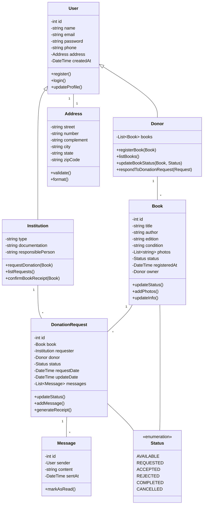

# Diagrama de Classes - Sistema de Doação de Livros

### Descrição das Classes e Relacionamentos

1. **User (Abstrata)**
   - Classe base para todos os usuários do sistema
   - Contém informações comuns como nome, email, senha e endereço
   - Gerencia autenticação e perfil do usuário

2. **Donor**
   - Herda de User
   - Representa o doador de livros
   - Gerencia lista de livros e responde a solicitações
   - Pode ter múltiplos livros cadastrados

3. **Institution**
   - Herda de User
   - Representa ONGs e bibliotecas
   - Possui documentação específica
   - Pode solicitar e confirmar recebimento de doações

4. **Book**
   - Representa o livro para doação
   - Mantém informações detalhadas e fotos
   - Possui status atual
   - Pertence a um Donor

5. **DonationRequest**
   - Gerencia o processo de doação
   - Conecta Donor, Institution e Book
   - Mantém histórico de mensagens
   - Controla status da doação

6. **Address**
   - Componente para endereços
   - Usada por User (composição)
   - Possui validação própria

7. **Status**
   - Enum para estados de Book e DonationRequest
   - Define todos os possíveis estados do processo

8. **Message**
   - Representa mensagens na comunicação
   - Vinculada a DonationRequest
   - Mantém histórico de comunicação

### Cardinalidades

- User-Address: 1:1 (cada usuário tem um endereço)
- Donor-Book: 1:N (um doador pode ter vários livros)
- Book-DonationRequest: 1:N (um livro pode ter várias solicitações)
- Institution-DonationRequest: 1:N (uma instituição pode fazer várias solicitações)
- DonationRequest-Message: 1:N (uma solicitação pode ter várias mensagens)