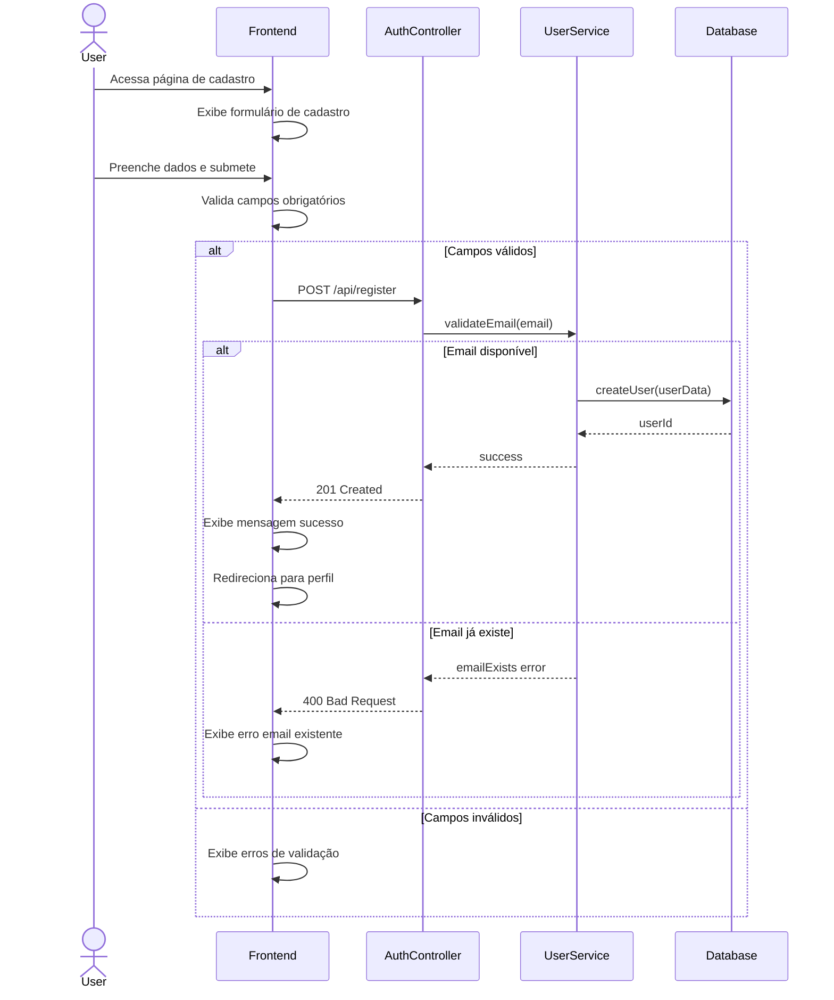
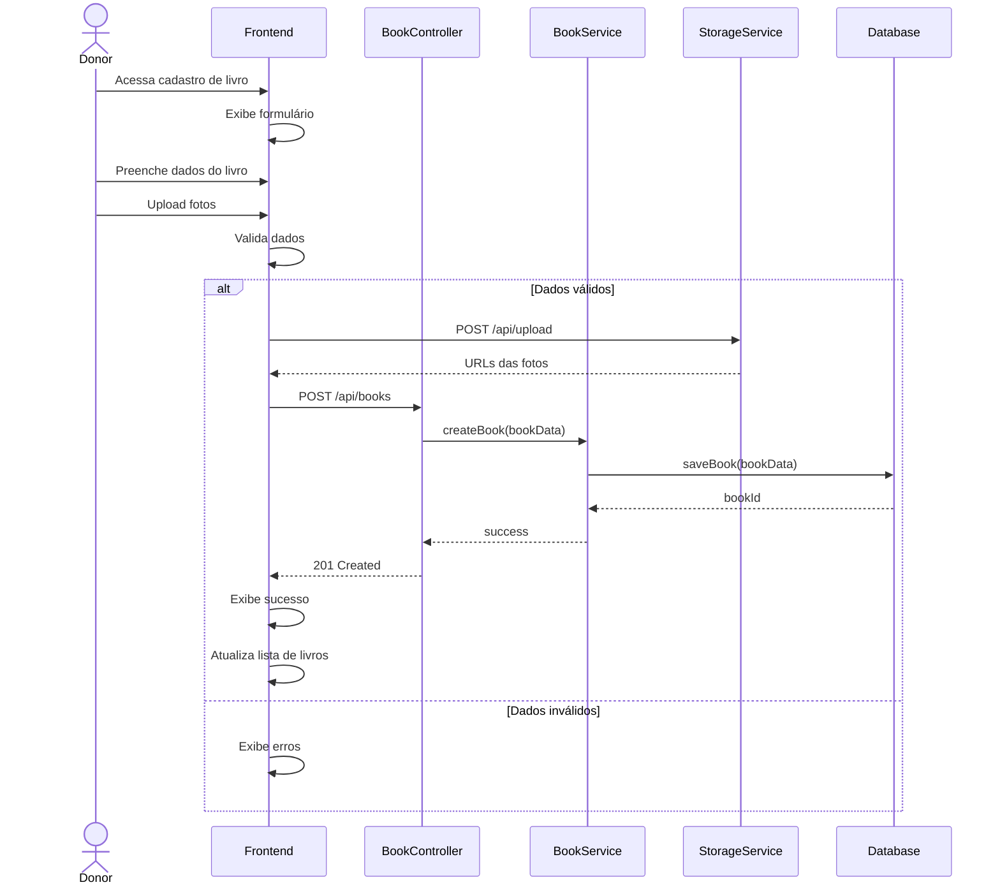
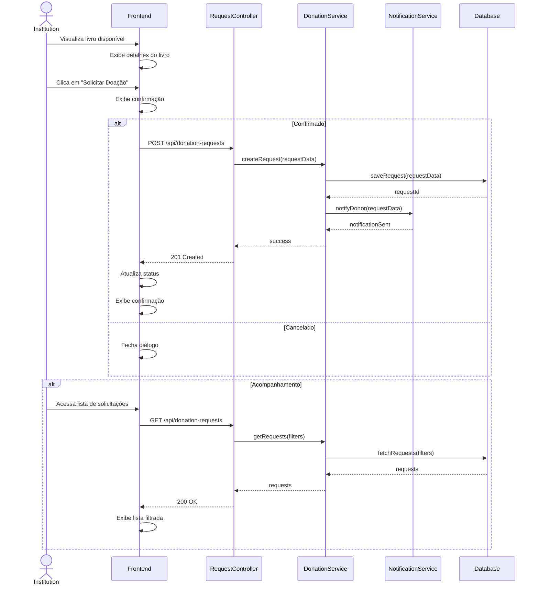

# Diagramas de Sequência - Sistema de Doação de Livros

## 1. Cadastro de Doador

## 2. Cadastro de Livro para Doação

## 3. Solicitação de Doação

### Descrição dos Componentes

1. **Frontend**
   - Interface do usuário
   - Validação client-side
   - Gerenciamento de estado
   - Roteamento

2. **Controllers**
   - AuthController: Gerencia autenticação
   - BookController: Gerencia operações de livros
   - RequestController: Gerencia solicitações

3. **Services**
   - UserService: Lógica de usuários
   - BookService: Lógica de livros
   - DonationService: Lógica de doações
   - StorageService: Gerencia upload de arquivos
   - NotificationService: Gerencia notificações

4. **Database**
   - Persistência de dados
   - Transações
   - Consultas

### Observações

- Os diagramas mostram o fluxo feliz e principais casos de erro
- Validações ocorrem tanto no frontend quanto no backend
- Notificações são assíncronas
- Uploads de arquivos são tratados separadamente
- Autenticação é verificada em todas as rotas protegidas