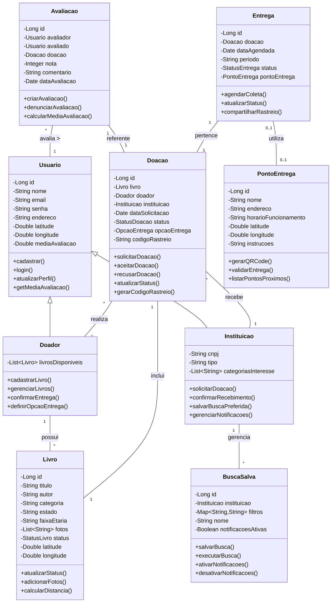

```mermaid
classDiagram
    class Usuario {
        -Long id
        -String nome
        -String email
        -String senha
        -String endereco
        -Double latitude
        -Double longitude
        -Double mediaAvaliacao
        +cadastrar()
        +login()
        +atualizarPerfil()
        +getMediaAvaliacao()
    }

    class Doador {
        -List~Livro~ livrosDisponiveis
        +cadastrarLivro()
        +gerenciarLivros()
        +confirmarEntrega()
        +definirOpcaoEntrega()
    }

    class Instituicao {
        -String cnpj
        -String tipo
        -List~String~ categoriasInteresse
        +solicitarDoacao()
        +confirmarRecebimento()
        +salvarBuscaPreferida()
        +gerenciarNotificacoes()
    }

    class Livro {
        -Long id
        -String titulo
        -String autor
        -String categoria
        -String estado
        -String faixaEtaria
        -List~String~ fotos
        -StatusLivro status
        -Double latitude
        -Double longitude
        +atualizarStatus()
        +adicionarFotos()
        +calcularDistancia()
    }

    class Doacao {
        -Long id
        -Livro livro
        -Doador doador
        -Instituicao instituicao
        -Date dataSolicitacao
        -StatusDoacao status
        -OpcaoEntrega opcaoEntrega
        -String codigoRastreio
        +solicitarDoacao()
        +aceitarDoacao()
        +recusarDoacao()
        +atualizarStatus()
        +gerarCodigoRastreio()
    }

    class Avaliacao {
        -Long id
        -Usuario avaliador
        -Usuario avaliado
        -Doacao doacao
        -Integer nota
        -String comentario
        -Date dataAvaliacao
        +criarAvaliacao()
        +denunciarAvaliacao()
        +calcularMediaAvaliacao()
    }

    class PontoEntrega {
        -Long id
        -String nome
        -String endereco
        -String horarioFuncionamento
        -Double latitude
        -Double longitude
        -String instrucoes
        +gerarQRCode()
        +validarEntrega()
        +listarPontosProximos()
    }

    class BuscaSalva {
        -Long id
        -Instituicao instituicao
        -Map~String,String~ filtros
        -String nome
        -Boolean notificacoesAtivas
        +salvarBusca()
        +executarBusca()
        +ativarNotificacoes()
        +desativarNotificacoes()
    }

    class Entrega {
        -Long id
        -Doacao doacao
        -Date dataAgendada
        -String periodo
        -StatusEntrega status
        -PontoEntrega pontoEntrega
        +agendarColeta()
        +atualizarStatus()
        +compartilharRastreio()
    }

    Usuario <|-- Doador
    Usuario <|-- Instituicao
    Doador "1" -- "*" Livro : possui
    Instituicao "1" -- "*" BuscaSalva : gerencia
    Doacao "1" -- "1" Livro : inclui
    Doacao "*" -- "1" Doador : realiza
    Doacao "*" -- "1" Instituicao : recebe
    Avaliacao "*" -- "1" Usuario : avalia >
    Avaliacao "1" -- "1" Doacao : referente
    Entrega "1" -- "1" Doacao : pertence
    Entrega "0..1" -- "0..1" PontoEntrega : utiliza
```