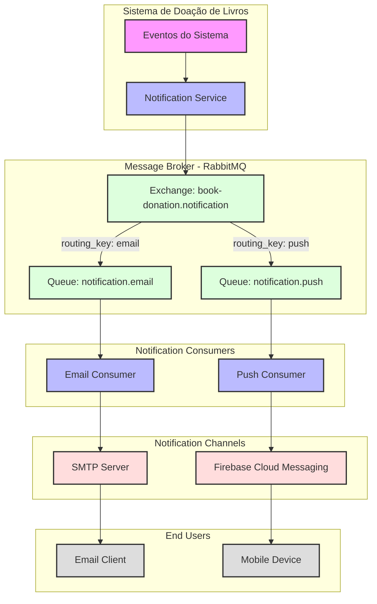

```mermaid
graph TB
    subgraph "Sistema de Doação de Livros"
        A[Eventos do Sistema] --> B[Notification Service]
    end

    subgraph "Message Broker - RabbitMQ"
        B --> C[Exchange: book-donation.notification]
        C -->|routing_key: email| D[Queue: notification.email]
        C -->|routing_key: push| E[Queue: notification.push]
    end

    subgraph "Notification Consumers"
        D --> F[Email Consumer]
        E --> G[Push Consumer]
    end

    subgraph "Notification Channels"
        F --> H[SMTP Server]
        G --> I[Firebase Cloud Messaging]
    end

    subgraph "End Users"
        H --> J[Email Client]
        I --> K[Mobile Device]
    end

    style A fill:#f9f,stroke:#333,stroke-width:2px
    style B fill:#bbf,stroke:#333,stroke-width:2px
    style C fill:#dfd,stroke:#333,stroke-width:2px
    style D fill:#dfd,stroke:#333,stroke-width:2px
    style E fill:#dfd,stroke:#333,stroke-width:2px
    style F fill:#bbf,stroke:#333,stroke-width:2px
    style G fill:#bbf,stroke:#333,stroke-width:2px
    style H fill:#fdd,stroke:#333,stroke-width:2px
    style I fill:#fdd,stroke:#333,stroke-width:2px
    style J fill:#ddd,stroke:#333,stroke-width:2px
    style K fill:#ddd,stroke:#333,stroke-width:2px
```