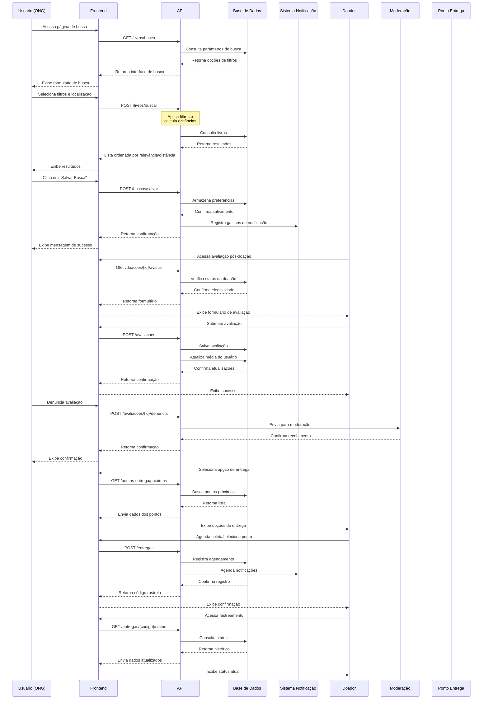

```mermaid
sequenceDiagram
    %% Diagrama 1: Busca Inteligente de Livros
    participant U as Usuario (ONG)
    participant F as Frontend
    participant A as API
    participant BD as Base de Dados
    participant N as Sistema Notificação

    %% Fluxo de Busca e Salvamento de Preferências
    U->>F: Acessa página de busca
    F->>A: GET /livros/busca
    A->>BD: Consulta parâmetros de busca
    BD-->>A: Retorna opções de filtros
    A-->>F: Retorna interface de busca
    F-->>U: Exibe formulário de busca

    U->>F: Seleciona filtros e localização
    F->>A: POST /livros/buscar
    Note over A: Aplica filtros e<br/>calcula distâncias
    A->>BD: Consulta livros
    BD-->>A: Retorna resultados
    A-->>F: Lista ordenada por relevância/distância
    F-->>U: Exibe resultados

    U->>F: Clica em "Salvar Busca"
    F->>A: POST /buscas/salvar
    A->>BD: Armazena preferências
    BD-->>A: Confirma salvamento
    A->>N: Registra gatilhos de notificação
    A-->>F: Retorna confirmação
    F-->>U: Exibe mensagem de sucesso

    %% Diagrama 2: Sistema de Avaliação
    participant D as Doador
    participant M as Moderação

    D->>F: Acessa avaliação pós-doação
    F->>A: GET /doacoes/{id}/avaliar
    A->>BD: Verifica status da doação
    BD-->>A: Confirma elegibilidade
    A-->>F: Retorna formulário
    F-->>D: Exibe formulário de avaliação

    D->>F: Submete avaliação
    F->>A: POST /avaliacoes
    A->>BD: Salva avaliação
    A->>BD: Atualiza média do usuário
    BD-->>A: Confirma atualizações
    A-->>F: Retorna confirmação
    F-->>D: Exibe sucesso

    U->>F: Denuncia avaliação
    F->>A: POST /avaliacoes/{id}/denuncia
    A->>M: Envia para moderação
    M-->>A: Confirma recebimento
    A-->>F: Retorna confirmação
    F-->>U: Exibe confirmação

    %% Diagrama 3: Logística de Entrega
    participant PE as Ponto Entrega

    D->>F: Seleciona opção de entrega
    F->>A: GET /pontos-entrega/proximos
    A->>BD: Busca pontos próximos
    BD-->>A: Retorna lista
    A-->>F: Envia dados dos pontos
    F-->>D: Exibe opções de entrega

    D->>F: Agenda coleta/seleciona ponto
    F->>A: POST /entregas
    A->>BD: Registra agendamento
    A->>N: Agenda notificações
    BD-->>A: Confirma registro
    A-->>F: Retorna código rastreio
    F-->>D: Exibe confirmação

    D->>F: Acessa rastreamento
    F->>A: GET /entregas/{codigo}/status
    A->>BD: Consulta status
    BD-->>A: Retorna histórico
    A-->>F: Envia dados atualizados
    F-->>D: Exibe status atual
```